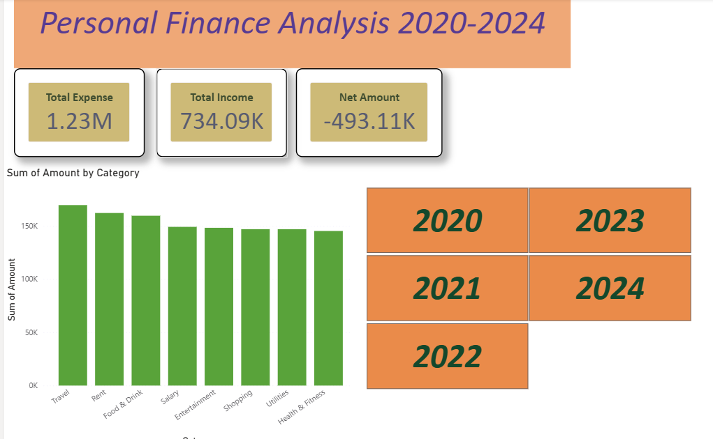

# Personal Finance Dashboard (2020-2024)
 
## Overview
An interactive Power BI dashboard analyzing 5 years of personal finance data 
(2020-2024) to identify spending patterns, category-wise breakdown, and 
overall income vs expense trends.

## Tools Used
- Microsoft Excel (Pivot Tables for initial data exploration)
- Power BI Desktop (dashboard building, DAX measures)

## Key Insights
- **Travel** was the highest expense category overall (₹1,69,497), followed 
  by Rent and Food & Drink.
- Travel spending dropped sharply from ₹49,156 (2020) to ₹23,166 (2022), 
  then recovered to ₹40,314 by 2024.
- Total expenses (₹12.27L) exceeded total income (₹7.34L) over the 5-year 
  period, resulting in a net deficit of ₹4.93L — highlighting a spending 
  pattern worth addressing.

## Dashboard Features
- KPI cards for Total Expense, Total Income, and Net Amount
- Category-wise expense breakdown (column chart)
- Year-based slicer for interactive filtering

## Note
Dataset used is a sample/practice dataset used to demonstrate 
data analysis and dashboarding skills.
